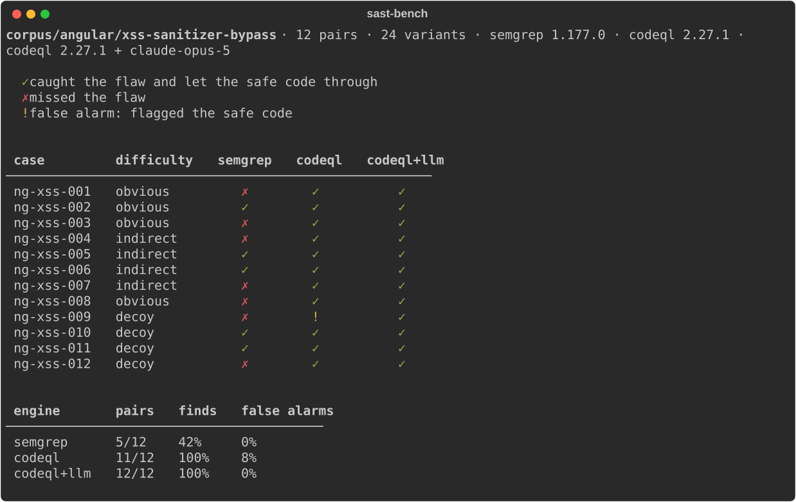
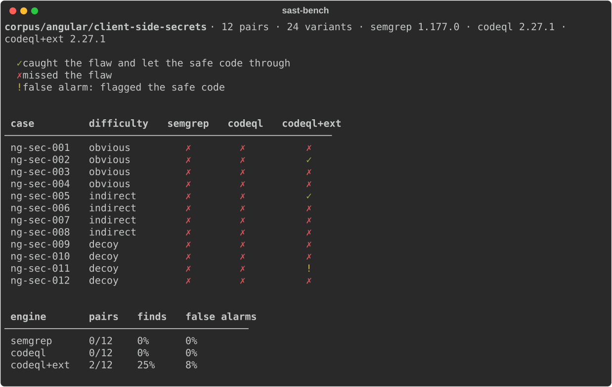

# sast-bench

**A benchmark that measures what security scanners miss in Angular apps, and
what they flag that they shouldn't.**

Every vulnerable case has a safe twin: the same pattern, done right. A tool only
gets credit for a pair if it flags the vulnerable one **and** stays quiet on the
safe one.



## Key findings

**1. CodeQL does not see the token a single-page app stores after login.**
On the client-side secrets family, CodeQL's `javascript-security-extended`
suite solves **0 of 12 pairs**. That includes this:

```ts
localStorage.setItem('access_token', response.accessToken);
```

The two high-precision queries that should catch it
(`js/clear-text-storage-of-sensitive-data` and `js/clear-text-logging`) decide
what is sensitive **by variable name**. The name heuristic in
`SensitiveDataHeuristics.qll` covers `password`, `secret`, `apiKey`, `authKey`
and `oauth`, but not `accessToken`, `jwt` or `bearer`. Test probes confirm it:
the same flow fires when the variable is called `password`, and stays silent
when it is called `accessToken`, wherever the data comes from.

**2. A small QL extension fixes part of it, and shows where the rest comes from.**
[`runners/codeql-ext/`](runners/codeql-ext/) adds session-credential names to
the heuristic. Result: **0/12 → 2/12**. The token in `localStorage` is caught,
directly and through a helper service. A third case is detected but the safe
twin gets flagged too (it stores `sessionToken.slice(0, 8)`, an opaque
reference, and a name cannot tell the difference). The other **9 cases don't
move**, and a name list can't fix them. They are modeling limits: data flowing
through Angular's `HttpClient` into an interceptor, whole objects being logged,
secrets compiled into the bundle, in-memory caches.

**3. On XSS, taint tracking is what counts.** Semgrep solves **5/12** pairs and
CodeQL **11/12**. CodeQL's one miss is a false alarm on a decoy's safe twin.
Adding an LLM that reviews each CodeQL finding gets to **12/12**. Keep this in
proportion: the filter only had to dismiss one finding. Running it with the
prompt in Spanish and in English gave the same 16 verdicts.

## Why this exists

RealVuln covers Python and the OWASP Benchmark covers Java. There was nothing
comparable for Angular, a framework with its own attack surface:
`bypassSecurityTrust*`, `Renderer2`, route guards, interceptors.

Most benchmarks also report recall only. In practice, the cost of a scanner is
as much what it flags wrongly as what it misses. The twin design measures both
at once.

## How it measures

**Pairs.** Each case is a directory with a `vulnerable/` and a `safe/` variant
and a `meta.yaml` with the family, CWE, difficulty, sink line and a rationale
for each side. A real pair from the corpus, where the only difference is one
identifier:

```diff
     const raw = this.route.snapshot.queryParamMap.get('summary') ?? '';
     const clean = this.sanitizer.sanitize(SecurityContext.HTML, raw) ?? '';
     if (clean.length === 0) {
       return;
     }
-    this.summary = this.sanitizer.bypassSecurityTrustHtml(raw);
+    this.summary = this.sanitizer.bypassSecurityTrustHtml(clean);
```

**Difficulty.** Each family has 4 pairs of each kind:

- **obvious**: the data goes straight from source to sink.
- **indirect**: the data crosses services, pipes, helpers or components first.
- **decoy**: both sides have visible validation, and the vulnerable side's is
  insufficient. It tests whether a tool *reads* the check or just sees one.

**Scoring.** A finding counts if its rule maps to the case's family
(`scoring/rule_map/`, maintained by hand). The headline is the **pair score**:
pairs with a hit on the vulnerable side *and* nothing on the safe side, over
the total. A tool that flags everything gets 100% recall and a pair score of 0.
Recall, FPR, precision, F1 and localization (finding within ±3 lines of the
sink) are reported next to it.

The full design is in [PROJECT.md](PROJECT.md).

## Results

36 pairs, 72 variants. One run per cell.

**xss-sanitizer-bypass** (manual trust, raw HTML in the DOM, DOM access that goes around the framework, unvalidated URLs)

| tool | pair score | recall | FPR |
|---|---|---|---|
| Semgrep 1.177.0 | 5/12 | 0.42 | 0.00 |
| CodeQL 2.27.1 | 11/12 | 1.00 | 0.08 |
| CodeQL + claude-opus-5 filter | 12/12 | 1.00 | 0.00 |

**client-side-secrets** (secrets in config, tokens in browser storage, sensitive data in logs and caches)

| tool | pair score | recall | FPR |
|---|---|---|---|
| Semgrep 1.177.0 | 0/12 | 0.00 | 0.00 |
| CodeQL 2.27.1 | 0/12 | 0.00 | 0.00 |
| CodeQL + extension | 2/12 | 0.25 | 0.08 |

Semgrep's zero here is a property of its rule set, not of the engine: the
secrets rules in the pinned set target Express, passport or `jsonwebtoken`,
or require the `jwt-decode` library, not idiomatic browser code.



**broken-authorization** (authority that lives on the client: roles in
storage, unverified JWT claims, ids taken from the URL): **pending**. The 12
pairs are written and the [prediction](results/prediccion-authz.md) is
committed; the runs come next.

## Predictions first

Before each family is run, a prediction is written and committed: which cases
each tool should catch, and why. Then the run either confirms it or it doesn't.

- [Secrets](results/prediccion-secrets.md): predicted CodeQL at about 7/12. It
  got **0/12**. Finding out why led to finding 1.
- [CodeQL extension](results/prediccion-codeql-ext.md): predicted 3 detections,
  1 false alarm, 2/12 pairs. The run matched it case by case.
- [Authorization](results/prediccion-authz.md): predicted ~0/12 for both tools.
  Not run yet.

These files, and the older reports in `results/`, are in Spanish. They are
dated records and are kept unedited on purpose.

## Limitations

- **The corpus is written by the author**, who knew the tools while writing it.
  The committed predictions help, but they don't remove the bias.
- **12 pairs per family, one run per cell.** Read the results as patterns, not
  as precise percentages.
- **The rule maps are maintained by hand.** A rule mapped to the wrong family
  changes the score. Unmapped rules are reported as noise and never dropped
  silently.
- **Authorization is measured from the client.** The server is not in the
  corpus, so the family measures whether the client trusts something the user
  controls. An Angular guard can always be bypassed, in the safe twin too.
- **The LLM filter only removes findings, it never adds them.** It cannot
  recover what CodeQL missed, which is why it did nothing on secrets.

## Usage

```bash
uv sync
uv run python -m scripts.fetch_rules    # Semgrep rules (not redistributable)
uv run python -m scripts.fetch_codeql   # CodeQL bundle (not redistributable)
cp .env.example .env                    # only for the LLM filter
uv run sast-bench doctor                # what is missing and how to fix it
```

```bash
sast-bench run --engine semgrep                        # whole corpus
sast-bench run --engine codeql --family secrets        # one family: xss, secrets, authz
sast-bench run --engine codeql --codeql-ext            # CodeQL + the extension
sast-bench run --engine hybrid --family xss --dry-run  # calls and estimated cost, nothing runs

sast-bench history                                     # every run
sast-bench show latest                                 # the case table of a run
sast-bench compare <run-a> <run-b>                     # which cases changed outcome
sast-bench report <run-id>                             # report.md + report.svg

sast-bench corpus validate                             # meta.yaml checks
sast-bench corpus stats                                # pairs per family and difficulty
```

Prefix with `uv run` if the venv is not active. Each run is stored in
`results/runs/<run-id>/` with a `manifest.json` that records the repo commit,
filters, engine versions, rules commit, model and token usage. CodeQL databases
are cached by variant content, so a run where nothing changed only pays for
the analysis.

## Repository layout

```
corpus/angular/<family>/<NNN-case>/   meta.yaml + vulnerable/ + safe/
runners/                              semgrep.py, codeql.py, hybrid.py, codeql-ext/
scoring/                              normalization, metrics, rule maps, tables
sast_bench/                           the sast-bench CLI
results/                              runs, predictions, comparisons
docs/                                 images used in this README
```

## Roadmap

- Run the broken-authorization family and check it against its prediction.
- Measure the extension's cost on real Angular projects: how many new alerts,
  and how many are real. That is the evidence an upstream issue to CodeQL needs.
- Run the LLM alone, blind and guided, to see whether it finds what the
  rule-based tools miss, and how many safe twins it flags.
- Add ESLint (`@angular-eslint` + `eslint-plugin-security`) as the floor: what
  teams already catch without installing anything.

## License

MIT. The Semgrep rules and the CodeQL CLI have their own licenses and are not
included; `scripts/` downloads them.
