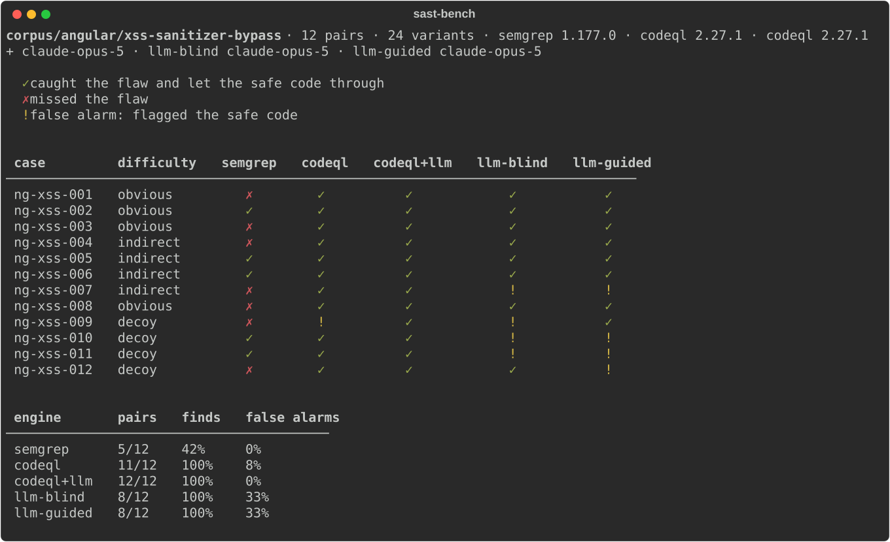
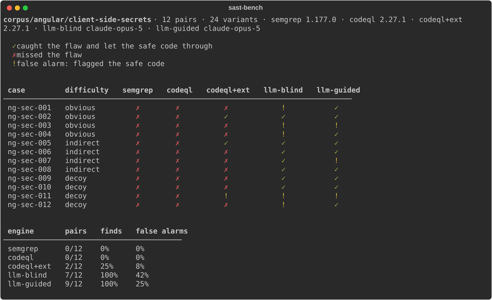
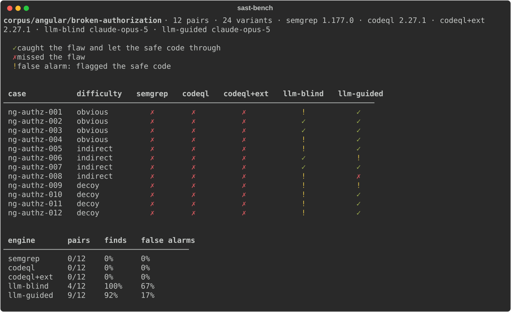

# sast-bench

**A benchmark that measures what security scanners miss in Angular apps, and
what they flag that they shouldn't.**

Every vulnerable case has a safe twin: the same pattern, done right. A tool only
gets credit for a pair if it flags the vulnerable one **and** stays quiet on the
safe one.

| | XSS | secrets | authorization | **total** | cost of a full run |
|---|---|---|---|---|---|
| Semgrep | 5 | 0 | 0 | **5/36** | US$ 0 |
| CodeQL | 11 | 0 | 0 | **11/36** | US$ 0 |
| LLM alone, blind | 8 | 7 | 4 | **19/36** | US$ 1.29 |
| LLM alone, guided | 8 | 9 | 9 | **26/36** | US$ 1.12 |

Pairs solved, out of 12 per family. The LLM is `claude-opus-5`; its cost is
the API bill for one pass over the 72 variants. Details, extensions and
per-case tables are below.

## Key findings

**1. CodeQL does not see the token a single-page app stores after login.**
On the client-side secrets family, CodeQL's `javascript-security-extended`
suite solves **0 of 12 pairs**. That includes this:

```ts
localStorage.setItem('access_token', response.accessToken);
```

The two high-precision queries that should catch it
(`js/clear-text-storage-of-sensitive-data` and `js/clear-text-logging`) decide
what is sensitive **by variable name**. The name heuristic in
`SensitiveDataHeuristics.qll` covers `password`, `secret`, `apiKey`, `authKey`
and `oauth`, but not `accessToken`, `jwt` or `bearer`. Test probes confirm it:
the same flow fires when the variable is called `password`, and stays silent
when it is called `accessToken`, wherever the data comes from.

**2. A small QL extension fixes part of it, and shows where the rest comes from.**
[`runners/codeql-ext/`](runners/codeql-ext/) adds session-credential names to
the heuristic. Result: **0/12 → 2/12**. The token in `localStorage` is caught,
directly and through a helper service. A third case is detected but the safe
twin gets flagged too (it stores `sessionToken.slice(0, 8)`, an opaque
reference, and a name cannot tell the difference). The other **9 cases don't
move**, and a name list can't fix them. They are modeling limits: data flowing
through Angular's `HttpClient` into an interceptor, whole objects being logged,
secrets compiled into the bundle, in-memory caches.

**3. On XSS, taint tracking is what counts.** Semgrep solves **5/12** pairs and
CodeQL **11/12**. CodeQL's one miss is a false alarm on a decoy's safe twin.
Adding an LLM that reviews each CodeQL finding gets to **12/12**. Keep this in
proportion: the filter only had to dismiss one finding. Running it with the
prompt in Spanish and in English gave the same 16 verdicts.

**4. Authorization flaws are invisible to rule-based tools.** On the
broken-authorization family, Semgrep and CodeQL both solve **0/12**. These
tools track dangerous data flowing into a sink. Here the flaw is *where the
authority lives*: a role read from `localStorage`, unverified JWT claims, an
account id taken from the URL. None of that has a sink to track. The closest
call: CodeQL's `js/client-side-request-forgery` flagged the exact line of one
case, but for a different reason (see Results).

**5. An LLM alone finds everything, and flags half of what is safe.** Reviewing
each variant on its own, with no rule-based tool and without being told what to
look for, the model catches **all 36** vulnerable variants and flags **17 of
the 36** safe twins: 19/36 pairs. On authorization it is 4/12, because "a guard
in the browser can be bypassed" is also true of a guard that asks the server.
Told what each family means (the guided arm), it drops to 9 flagged safe twins
and reaches **26/36**; authorization goes from 4/12 to 9/12. The model does not
lack the ability to tell the twins apart, it lacks the criterion. Two caveats:
the guided prompt contains the benchmark's own definition of the family, and
this is one run per cell.

The LLM also found two defects in the corpus: two "safe" authorization twins
still read the JWT from `localStorage`, which the secrets family itself counts
as a vulnerability. They were fixed and re-run, and the fix is declared in the
[commit history](https://github.com/gonzavh17/sast-bench/commits/main).

## Why this exists

RealVuln covers Python and the OWASP Benchmark covers Java. There was nothing
comparable for Angular, a framework with its own attack surface:
`bypassSecurityTrust*`, `Renderer2`, route guards, interceptors.

Most benchmarks also report recall only. In practice, the cost of a scanner is
as much what it flags wrongly as what it misses. The twin design measures both
at once.

## How it measures

**Pairs.** Each case is a directory with a `vulnerable/` and a `safe/` variant
and a `meta.yaml` with the family, CWE, difficulty, sink line and a rationale
for each side. A real pair from the corpus, where the only difference is one
identifier:

```diff
     const raw = this.route.snapshot.queryParamMap.get('summary') ?? '';
     const clean = this.sanitizer.sanitize(SecurityContext.HTML, raw) ?? '';
     if (clean.length === 0) {
       return;
     }
-    this.summary = this.sanitizer.bypassSecurityTrustHtml(raw);
+    this.summary = this.sanitizer.bypassSecurityTrustHtml(clean);
```

**Difficulty.** Each family has 4 pairs of each kind:

- **obvious**: the data goes straight from source to sink.
- **indirect**: the data crosses services, pipes, helpers or components first.
- **decoy**: both sides have visible validation, and the vulnerable side's is
  insufficient. It tests whether a tool *reads* the check or just sees one.

**Scoring.** A finding counts if its rule maps to the case's family
(`scoring/rule_map/`, maintained by hand). The headline is the **pair score**:
pairs with a hit on the vulnerable side *and* nothing on the safe side, over
the total. A tool that flags everything gets 100% recall and a pair score of 0.
Recall, FPR, precision, F1 and localization (finding within ±3 lines of the
sink) are reported next to it.

The full design is in [PROJECT.md](PROJECT.md).

## Results

36 pairs, 72 variants, three families. One run per cell.

**xss-sanitizer-bypass** (manual trust, raw HTML in the DOM, DOM access that goes around the framework, unvalidated URLs)

| tool | pair score | recall | FPR |
|---|---|---|---|
| Semgrep 1.177.0 | 5/12 | 0.42 | 0.00 |
| CodeQL 2.27.1 | 11/12 | 1.00 | 0.08 |
| CodeQL + claude-opus-5 filter | 12/12 | 1.00 | 0.00 |
| LLM alone, blind | 8/12 | 1.00 | 0.33 |
| LLM alone, guided | 8/12 | 1.00 | 0.33 |



**client-side-secrets** (secrets in config, tokens in browser storage, sensitive data in logs and caches)

| tool | pair score | recall | FPR |
|---|---|---|---|
| Semgrep 1.177.0 | 0/12 | 0.00 | 0.00 |
| CodeQL 2.27.1 | 0/12 | 0.00 | 0.00 |
| CodeQL + extension | 2/12 | 0.25 | 0.08 |
| LLM alone, blind | 7/12 | 1.00 | 0.42 |
| LLM alone, guided | 9/12 | 1.00 | 0.25 |

Semgrep's zero here is a property of its rule set, not of the engine: the
secrets rules in the pinned set target Express, passport or `jsonwebtoken`,
or require the `jwt-decode` library, not idiomatic browser code.



**broken-authorization** (authority that lives on the client: roles in
storage, unverified JWT claims, ids taken from the URL)

| tool | pair score | recall | FPR |
|---|---|---|---|
| Semgrep 1.177.0 | 0/12 | 0.00 | 0.00 |
| CodeQL 2.27.1 | 0/12 | 0.00 | 0.00 |
| CodeQL + extension | 0/12 | 0.00 | 0.00 |
| LLM alone, blind | 4/12 | 1.00 | 0.67 |
| LLM alone, guided | 9/12 | 0.92 | 0.17 |

These numbers include the corpus fix: ng-authz-006 and ng-authz-011 come from
a re-run after it, the other ten cases from the original run
([`results/merged/`](results/merged/), with the sources of each file).

One near miss for CodeQL. `js/client-side-request-forgery` (CWE-918) fired on the
vulnerable side of ng-authz-012, on the exact line: a `DELETE` whose account id
comes from `?user=` in the URL. It stays out of the score because the rule is
not mapped to this family, which is what the prediction said before the run.
Mapping it now would mean moving the goalposts after seeing the result. It also
only works by accident of source kind: the query ignores Angular route
parameters (`/users/:id`) and only follows query-string ones, so the three
cases that take the id from the route path go unseen.



## Predictions first

Before each family is run, a prediction is written and committed: which cases
each tool should catch, and why. Then the run either confirms it or it doesn't.

- [Secrets](results/prediccion-secrets.md): predicted CodeQL at about 7/12. It
  got **0/12**. Finding out why led to finding 1.
- [CodeQL extension](results/prediccion-codeql-ext.md): predicted 3 detections,
  1 false alarm, 2/12 pairs. The run matched it case by case.
- [Authorization](results/prediccion-authz.md): predicted 0/12 for both tools,
  with `js/client-side-request-forgery` as the only query that might fire. The
  score matched and so did the query, but the stated reason was wrong: the
  prediction said a `/api/...` prefix would sanitize the URL, and what actually
  decides is whether the id comes from the route path or the query string.
- [LLM alone](results/prediction-llm.md): predicted ~19/36 for the blind arm,
  with authorization as the family where false alarms eat most of the gain.
  It got 19/36, and authorization was the worst family. The guided arm was
  predicted at about the same or lower; it got 26/36. That one was wrong.

The first three files, and the older reports in `results/`, are in Spanish. They are
dated records and are kept unedited on purpose.

## Limitations

- **The corpus is written by the author**, who knew the tools while writing it.
  The committed predictions help, but they don't remove the bias.
- **12 pairs per family, one run per cell.** Read the results as patterns, not
  as precise percentages.
- **The rule maps are maintained by hand.** A rule mapped to the wrong family
  changes the score. Unmapped rules are reported as noise and never dropped
  silently.
- **Authorization is measured from the client.** The server is not in the
  corpus, so the family measures whether the client trusts something the user
  controls. An Angular guard can always be bypassed, in the safe twin too.
- **The LLM filter only removes findings, it never adds them.** It cannot
  recover what CodeQL missed, which is why it did nothing on secrets.
- **The guided LLM arm is told the family definitions**, which are the
  benchmark's own criteria. Its score is a ceiling, not what a developer gets
  by asking "is this code secure?"; the blind arm is closer to that.
- **Two authorization cases were fixed after the LLM runs.** The fix follows
  the corpus's written rules and is declared, but it came after seeing results.

## Usage

```bash
uv sync
uv run python -m scripts.fetch_rules    # Semgrep rules (not redistributable)
uv run python -m scripts.fetch_codeql   # CodeQL bundle (not redistributable)
cp .env.example .env                    # only for the LLM engines
uv run sast-bench doctor                # what is missing and how to fix it
```

```bash
sast-bench run --engine semgrep                        # whole corpus
sast-bench run --engine codeql --family secrets        # one family: xss, secrets, authz
sast-bench run --engine codeql --codeql-ext            # CodeQL + the extension
sast-bench run --engine hybrid --family xss --dry-run  # calls and estimated cost, nothing runs
sast-bench run --engine llm --arm blind                # the LLM alone (asks the API)
sast-bench run --engine llm --provider nim --model openai/gpt-oss-20b   # free debug run (NVIDIA NIM)
sast-bench run --engine codeql --case ng-sec-002 --case ng-sec-011   # specific cases

sast-bench history                                     # every run
sast-bench show latest                                 # the case table of a run
sast-bench compare <run-a> <run-b>                     # which cases changed outcome
sast-bench report <run-id>                             # report.md + report.svg

sast-bench corpus validate                             # meta.yaml checks
sast-bench corpus stats                                # pairs per family and difficulty
```

Runs with `--provider nim` are for debugging prompts and the pipeline for
free: they are marked as debug, hidden from `history` and `compare` unless you
pass `--include-debug`, and report what the same tokens would have cost with
Opus. Every number in this README comes from Claude runs.

Prefix with `uv run` if the venv is not active. Each run is stored in
`results/runs/<run-id>/` with a `manifest.json` that records the repo commit,
filters, engine versions, rules commit, model, token usage and cost. `show`
and `compare` print the cost and the pairs solved per dollar next to the
scores. CodeQL databases
are cached by variant content, so a run where nothing changed only pays for
the analysis.

## Repository layout

```
corpus/angular/<family>/<NNN-case>/   meta.yaml + vulnerable/ + safe/
runners/                              semgrep.py, codeql.py, hybrid.py, llm.py, codeql-ext/
scoring/                              normalization, metrics, rule maps, tables
sast_bench/                           the sast-bench CLI
results/                              runs, merged tables, predictions, comparisons
docs/                                 images used in this README
```

## Roadmap

**v1, this repo: a benchmark for Angular.** Still open:

- Measure the extension's cost on real Angular projects: how many new alerts,
  and how many are real. That is the evidence an upstream issue to CodeQL needs.
- Bring your own scanner: score any tool's SARIF output against the corpus.
- Add ESLint (`@angular-eslint` + `eslint-plugin-security`) as the floor: what
  teams already catch without installing anything.
- More than one run per cell, and other models and effort levels for the LLM.

**v2: an analyzer for Node/TypeScript backends.** What v1 measured, turned into
something you run on your own project: deterministic rules for the first pass
(taint tracking where it works) and an LLM for what rules cannot see, like
where authorization lives. v1 showed each half fails alone in a different way:
rules miss whole families, the LLM flags half of what is safe. The corpus
format already supports a second ecosystem (`corpus/<ecosystem>/`), so the
backend gets its own benchmark first, and the analyzer is measured against it.

One thing to plan for: the CodeQL CLI is free only on open source code. Running
it on a private codebase needs a GitHub Advanced Security license, so a tool
meant for any project cannot depend on it alone.

## License

MIT. The Semgrep rules and the CodeQL CLI have their own licenses and are not
included; `scripts/` downloads them.
